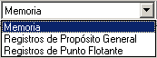

Contiene las herramientas que permiten llevar a cabo las simulaciones.

 Permite comenzar la ejecución continua de la simulación. Si se pulsa mientras está ejecutandose otra simulación, se ofrece la opción de comenzar desde el principio. La ejecución continua sólo se detiene al llegar al final del programa o si encuentra un Break Point.

 Permite comenzar (continuar) una ejecución paso a paso. Cada vez que se hace clic en este botón la simulación avanza un ciclo.

 Permite pausar una ejecución iniciada en modo continuo. Después puede proseguirse con la ejecución en modo continuo o paso a paso.

 Detiene una ejecución poniendo el reloj a 0.

 Permite escoger un componente de la máquina para visualizar.

 Permite cambiar la máquina con la que se quiere realizar una simulación.

This tool bar contains all execution options.

{bmc bm10.BMP}

{bml bm11.BMP} Click this button to start a continuous simulation. If you use this option during an in-execution simulation, you can restart the simulation. Continuous execution stops when the last instruction is finished or when it finds a Breakpoint.

{bml bm12.BMP} Click this item to start or continue a step by step execution. Every time you press this button the simulation steps one clock cycle.

{bml bm13.BMP} Click this button to pause a continuous execution. When an execution is paused, you can continue by pressing "Start" (continuous execution) or "Step" (step by step execution).

{bml bm14.BMP} Click this button to stop execution and reset the clock.

{bml bm15.BMP} Use this combo item to view and modify registers and memory from the currently selected processor.

{bml bm16.BMP} Use this combo to select the current processor for simulations: Superscalar or VLIW.