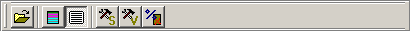

This tool bar contains general options.

 Click this button to open a sequential code file.

 Permite abrir un fichero con código secuencial.

 Habilita la opción de colorear los bloques básicos en el código.

 Muestra/oculta el código secuencial cargado de fichero.

 Abre la ventana de Configuración de la Máquina Superescalar, con la que se pueden modificar sus parámetros más importantes.

 Abre la ventana de Configuración de la Máquina VLIW, con la que se pueden modificar sus parámetros más importantes.

 Permite establecer el porcentaje de fallos de caché de datos al realizar una instrucción de carga (LOAD). 0 significa que no habrá ningún fallo y 100 significa que todos los accesos producen fallo.

{bml bm2.BMP} Click this button to open a sequential code file.

{bml bm3.BMP} Click this button to colour the basic blocks in code window.

{bml bm4.BMP} Click this button to show/hide the sequential code loaded from a file.

{bml bm5.BMP} Click this button to open the Superscalar Configuration window.

{bml bm6.BMP} Click this button to open the VLIW Configuration window.

{bml bm7.BMP} Click this button to set the data cache miss rate when you use a LOAD instruction. Use 0 for no misses and 100 for direct main memory access.

{bml bm8.BMP} Click this button to create a blank VLIW code.

{bml bm9.BMP} Click this button to load a VLIW code from a file.