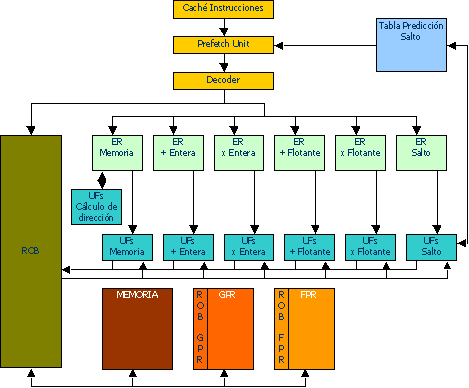

### Characteristics

1. Control of the processor based on Tomasulo's algorithm.

2. The Issue Rate is the most important parameter for this processor. The Issue Rate is the maximum number of instructions issued per cycle (and consequently the maximum number of instructions that may commit per cycle).

3. It uses dynamic branch prediction.

### Components

* **Prefetch**: Prefetch unit.

* **Decoder**: Decoder Unit

* **ROB<->GPR**: ROB entry where a General Purpose Register is being processed.  

* **ROB<->FPR**: ROB entry where a Floating Point Register is being processed. 

* **Branch Prediction**: 2-bit Branch Prediction Table. 

* **ROB**: Reorder Buffer. 

* **RE**: Reservation Stations. 

* **FU**: Functional Units. 

* **Address computing ALU**: This unit computes memory addresses.