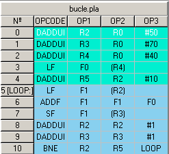

The Instruction Window shows the sequential code loaded from a file.

The instructions are showed in sequential order.

The first column shows the instruction number, used as identifier. The instruction labels are showed enclosed by brackets ([label:]) next to the instruction identifier.

The second column shows the opcode.

Columns third to fifth show the operands.

### Breakpoints

Double-click on any instruction field sets a Breakpoint. This breakpoint is valid for superscalar execution (VLIW breakpoints are set on long instructions). An instruction with a breakpoint is marked with a red background at the identifier column. You can quit a Breakpoint by double-clicking again on the instruction.

### Hide code

Double-click on the window title (where file name is showed) to hide the window. To show code window again, go to View => Sequencial Code.

### Basic Blocks

To differentiate code Basic Blocks go to View => Basic Blocks.