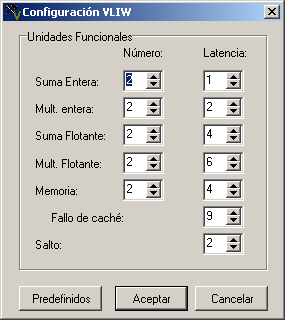
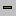

There are two different ways for showing General Purpose or Floating Point Registers and Memory:

1. Click on menu Execute => Components and select a component.

2. Use the components combo box from the Execution Tool Bar.

 

This window allows the user to see a subset of registers (or memory positions) of the current component.

The first column shows the register index or memory position. The second one shows the value associated to this index/position (floating point values are rounded to 3 decimals).

There are a set of buttons below the window :

 Click this button to select a subset of registers/positions to show. The selection is making by using a comma-separated list of numbers or intervals (for example: 2,10-15,20).

 Click this button to select a subset of registers/positions to hide. The selection is making by using a comma-separated list of numbers or intervals (for example: 2,10-15,20).

 Click this button to save the changes made in the component.

 Click this button to cancel the changes made in the component.

 Reset all selected values.
