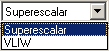

Contiene las herramientas que permiten llevar a cabo las simulaciones.

 Permite comenzar la ejecución continua de la simulación. Si se pulsa mientras está ejecutandose otra simulación, se ofrece la opción de comenzar desde el principio. La ejecución continua sólo se detiene al llegar al final del programa o si encuentra un Break Point.

 Permite comenzar (continuar) una ejecución paso a paso. Cada vez que se hace clic en este botón la simulación avanza un ciclo.

 Permite pausar una ejecución iniciada en modo continuo. Después puede proseguirse con la ejecución en modo continuo o paso a paso.

 Detiene una ejecución poniendo el reloj a 0.

 Permite escoger un componente de la máquina para visualizar.

 Permite cambiar la máquina con la que se quiere realizar una simulación.
