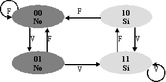

La Tabla de Predicción de Salto emplea un esquema de 2 bits para predecir si un salto debe ser tomado o no.

La tabla tiene 16 entradas, que se corresponden con los 4 últimos bits de la posición en memoria de la instrucción de salto.

El esquema de funcionamiento del algoritmo de 2 bits puede verse en el siguiente dibujo, donde se indica si el salto se toma o no, y las transiciones de estado se deben a si se ha acertado con la última predicción o no:

