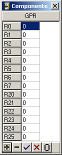

Para ver los Registros de Propósito General, los de Punto Flotante o la Memoria se pueden emplear dos métodos:

1. Ir al menú Ejecutar => Maquina Superescalar/VLIW => Componentes y elegir el componente correspondiente.

2. Desde la Barra de Herramientas de Ejecución usar el cuadro combinado de componentes.

La ventana permite ver un subconjunto de los elementos del componente seleccionado por el usuario.

La primera columna representa el índice o la posición, y la segunda columna representa el valor de esa posición (por claridad, los números en punto flotante se presentan siempre redondeados a 3 decimales).

Se presentan una serie de botones en la parte baja de la ventana:

 Permite seleccionar un subconjunto de elementos para mostrar mediante una lista de números o intervalos separados por comas (ej. 2,10-15,20).

Permite seleccionar un subconjunto de elementos para ocultar mediante una lista de números o intervalos separados por comas (ej. 2,10-15,20).

 Guarda los cambios realizados en el contenido del componente.

 Cancela los cambios realizados en el contenido del componente.

 Pone todos los elementos seleccionados a 0.
